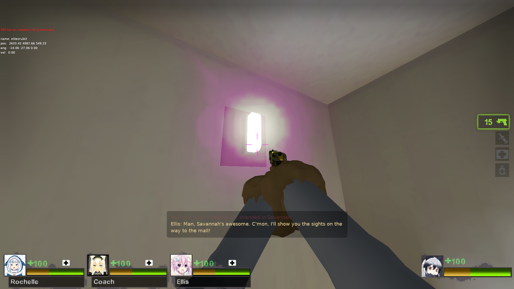
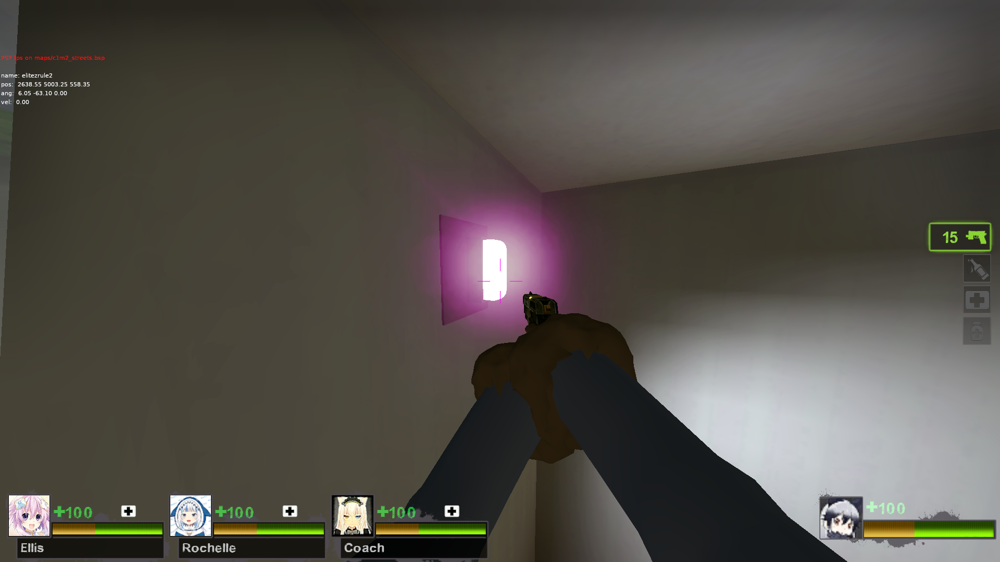

# meow pink lens flares  

### this is the [pink lens flares fx mod by sephora](https://steamcommunity.com/sharedfiles/filedetails/?id=2823948884) but with mip maps disabled 

mip maps lower the resolution of a texture depending on the graphics settings of the game  
i dont think this is a good thing for lens flares and stuff since they are not very large textures in first place and they are not present that much in the game  
they also look much worse with mip maps enabled since they are usually a gradient  
 

### [download the vpk](https://github.com/meow6969/l4d2-things/raw/refs/heads/master/meow_pink_lens_flares_fx.vpk)

# screenies: 

### before:   

### after:  

### before:  

  

### after:  

### before:  

### after:  

